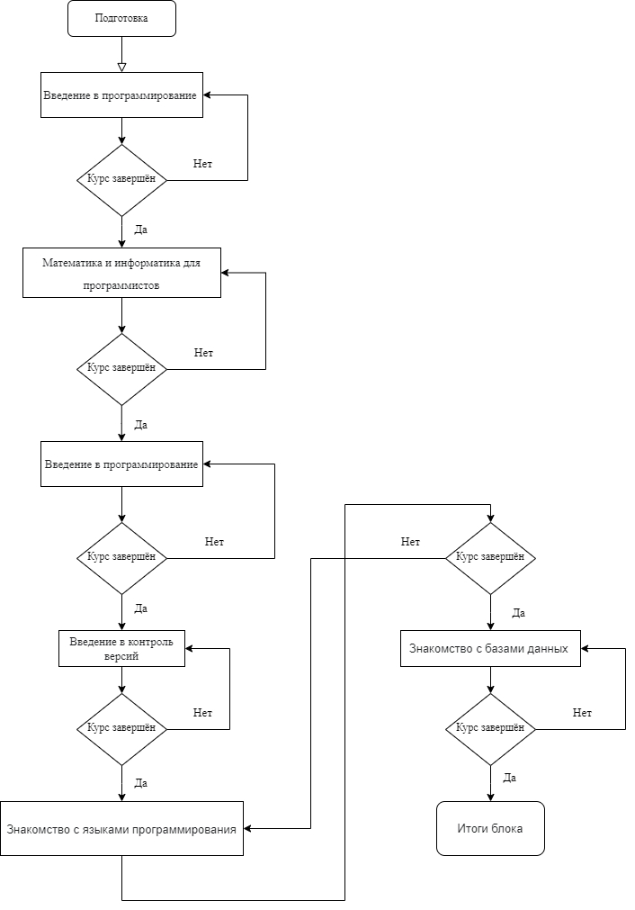

# Итоговая проверочная работа

1. Создать репозиторий на GitHub

## 1. Выполнено.

2. Нарисовать блок-схему алгоритма (можно обойтись блок-схемой основной содержательной части, если вы выделяете её в отдельный метод)
## 2. Алгоритма чего? Что в голову пришло, то и нарисовал ->

3. Снабдить репозиторий оформленным текстовым описанием решения (файл README.md)
## Описанием решения чего? Файл Readme создан, и сохранён в репозитории.
4. Написать программу, решающую поставленную задачу
## 4. Выполнено. Смотрите папку Task.
5. Использовать контроль версий в работе над этим небольшим проектом (не должно быть так, что всё залито одним коммитом, как минимум этапы 2, 3, и 4 должны быть расположены в разных коммитах)
## 5. Как минимум 2, 3 коммита существует при создании данного мини проекта.
# У меня нет слов от того как поставлено задание итоговой проверочной работы.